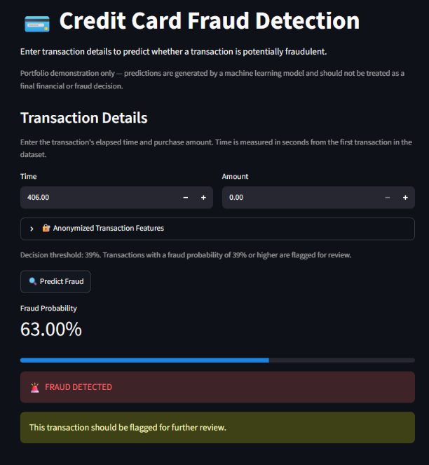

# Credit Card Fraud Detection



An end-to-end machine learning system for detecting fraudulent credit card transactions using **Random Forest**, with a **FastAPI REST API**, **Docker deployment**, and an interactive **Streamlit interface**.

## 📌 Project Overview

Credit card fraud detection is a highly imbalanced classification problem where fraudulent transactions represent only a very small fraction of all transactions.

This project builds a complete fraud detection pipeline that:

* Analyzes and cleans historical transaction data
* Handles severe class imbalance
* Trains a Random Forest classification model
* Evaluates performance using fraud-focused metrics
* Tunes the decision threshold using validation data
* Saves the trained model and decision threshold
* Exposes predictions through a FastAPI API
* Packages the application using Docker
* Provides an interactive Streamlit interface for predictions

The project is designed to demonstrate not only machine learning modeling, but also the **deployment and production workflow** behind a real-world ML application.

## 📊 Dataset

This project uses the **Credit Card Fraud Detection dataset** released by the Machine Learning Group of ULB (Université Libre de Bruxelles).

The dataset contains credit card transactions made by European cardholders over a two-day period.

### Dataset characteristics

| Feature                 | Details |
| ----------------------- | ------: |
| Total transactions      | 284,807 |
| Features                |      30 |
| Target variable         | `Class` |
| Legitimate transactions | 284,315 |
| Fraudulent transactions |     492 |
| Fraud rate              |  ~0.17% |

### Features

The dataset contains:

* `Time` — Seconds elapsed between each transaction and the first transaction
* `V1`–`V28` — PCA-transformed numerical features
* `Amount` — Transaction amount
* `Class` — Target variable

  * `0` = Legitimate transaction
  * `1` = Fraudulent transaction

### Class Imbalance

Fraudulent transactions represent only approximately **0.17%** of the dataset.

This severe class imbalance is one of the main challenges of the project because a model can achieve very high accuracy simply by predicting most transactions as legitimate.

Therefore, model evaluation focuses on metrics such as:

* **Precision**
* **Recall**
* **F1-score**
* **PR-AUC**

The raw dataset is intentionally **not included in this GitHub repository** because it is excluded through `.gitignore`.

## 🔄 Project Workflow

The project follows an end-to-end machine learning workflow:

```text
Raw Transaction Data
        ↓
Data Understanding & EDA
        ↓
Duplicate Removal
        ↓
Stratified Train/Test Split
        ↓
Train/Validation Split
        ↓
Random Forest Model
        ↓
Validation-Based Threshold Tuning
        ↓
Final Test Evaluation
        ↓
Model & Threshold Serialization
        ↓
FastAPI REST API
        ↓
Docker Container
        ↓
Streamlit User Interface
```

### Main stages

1. **Data Understanding & EDA**

   * Examined dataset structure and distributions
   * Checked missing values
   * Identified duplicate transactions
   * Analyzed class imbalance
   * Studied relationships between features and fraud

2. **Data Preparation**

   * Removed duplicate rows
   * Used stratified splitting to preserve the fraud ratio
   * Created separate training, validation, and test datasets

3. **Model Development**

   * Trained a Random Forest classifier
   * Used class weighting to address class imbalance

4. **Threshold Optimization**

   * Generated fraud probabilities on the validation set
   * Tested multiple classification thresholds
   * Selected a threshold based on validation F1-score
   * Locked the threshold before evaluating on the test set

5. **Model Evaluation**

   * Evaluated the final model on unseen test data
   * Used precision, recall, F1-score, confusion matrix, and PR-AUC

6. **Deployment**

   * Saved the trained model and decision threshold
   * Built a FastAPI prediction API
   * Containerized the application using Docker

7. **Interactive Application**

   * Built a Streamlit interface for entering transaction details
   * Displays the estimated fraud probability and final decision

## 📈 Model Performance

The final Random Forest model was evaluated on a completely unseen test set.

### Final Test Results

| Metric    |  Score |
| --------- | -----: |
| Accuracy  | 99.95% |
| Precision | 92.21% |
| Recall    | 74.74% |
| F1-score  | 82.56% |
| PR-AUC    | 0.8145 |

### Confusion Matrix

```text id="4u9n1h"
                  Predicted
                 Legit   Fraud
Actual Legit     56,645     6
Actual Fraud         24    71
```

This resulted in:

* **True Negatives (TN):** 56,645
* **False Positives (FP):** 6
* **False Negatives (FN):** 24
* **True Positives (TP):** 71

The model correctly identified **71 out of 95 fraudulent transactions**, resulting in a fraud recall of approximately **74.74%**.

Only **6 legitimate transactions** were incorrectly flagged as fraudulent.

### Decision Threshold

Instead of relying on the default classification threshold of 0.50, the model's fraud probability threshold was tuned using the validation dataset.

A threshold of **0.39** was selected because it achieved the highest validation F1-score among the tested thresholds.

The test set was evaluated only after the threshold was selected to avoid using test data during model selection.

## 🚀 Deployment

The trained fraud detection model is integrated into a lightweight application stack.

### FastAPI

A REST API was built using **FastAPI** to serve fraud predictions.

The API:

* Loads the trained Random Forest model
* Loads the optimized decision threshold
* Accepts transaction features as JSON
* Calculates fraud probability
* Applies the decision threshold
* Returns the prediction and fraud/legitimate decision

The interactive API documentation is available through FastAPI's Swagger UI.

### Docker

The application is containerized using Docker to provide a reproducible runtime environment.

The Docker image includes:

* Python runtime
* Project dependencies
* FastAPI application
* Trained model
* Decision threshold

### Streamlit

A Streamlit interface provides a simple user-facing application where transaction features can be entered and the model returns:

* Fraud probability
* Prediction
* Final transaction decision

## 🛠️ Tech Stack

| Category            | Technologies              |
| ------------------- | ------------------------- |
| Programming         | Python                    |
| Data Analysis       | Pandas, NumPy             |
| Visualization       | Matplotlib, Seaborn       |
| Machine Learning    | Scikit-learn              |
| Model               | Random Forest Classifier  |
| API                 | FastAPI                   |
| UI                  | Streamlit                 |
| Deployment          | Docker                    |
| Model Serialization | Joblib                    |
| Development         | Jupyter Notebook, VS Code |
| Version Control     | Git, GitHub               |

## 📁 Project Structure

```text
credit-card-fraud-detection/
│
├── data/
│   └── raw/
│       └── creditcard.csv              # Local dataset (not tracked by Git)
│
├── models/
│   ├── random_forest_fraud_model.pkl  # Trained Random Forest model
│   └── fraud_threshold.pkl             # Optimized decision threshold
│
├── notebooks/
│   └── 01_data_understanding.ipynb     # EDA and model development
│
├── src/
│   ├── __init__.py
│   ├── app.py                          # FastAPI application
│   ├── predict.py                      # Prediction logic
│   ├── streamlit_app.py                # Streamlit interface
│   └── test_prediction.py              # Prediction testing script
│
├── .gitignore
├── Dockerfile
├── requirements.txt
└── README.md
```

### Key components

* **`notebooks/`** — Data exploration, preprocessing, model development and evaluation
* **`models/`** — Serialized trained model and decision threshold
* **`src/app.py`** — FastAPI REST API
* **`src/predict.py`** — Shared prediction logic
* **`src/streamlit_app.py`** — Interactive Streamlit application
* **`src/test_prediction.py`** — Local prediction testing
* **`Dockerfile`** — Docker container configuration
* **`requirements.txt`** — Python dependencies
* **`.gitignore`** — Prevents datasets, virtual environments and other local files from being committed

## ⚙️ Installation & Usage

### 1. Clone the repository

```bash
git clone https://github.com/bhumikagadade-stack/credit-card-fraud-detection.git
cd credit-card-fraud-detection
```

### 2. Create a virtual environment

```bash
python -m venv venv
```

Activate it on Windows:

```powershell
venv\Scripts\activate
```

### 3. Install dependencies

```bash
pip install -r requirements.txt
```

### 4. Add the dataset

Download the `creditcard.csv` dataset and place it inside:

```text
data/raw/creditcard.csv
```

The dataset is intentionally excluded from GitHub through `.gitignore`.

### 5. Run the FastAPI application

```bash
uvicorn src.app:app --host 0.0.0.0 --port 8000
```

Open the interactive API documentation:

```text
http://localhost:8000/docs
```

### 6. Run the Streamlit application

In a separate terminal:

```bash
streamlit run src/streamlit_app.py
```

Streamlit will provide a local URL where the interactive fraud detection interface can be accessed.

### 7. Run using Docker

Build the Docker image:

```bash
docker build -t credit-card-fraud-detection .
```

Run the container:

```bash
docker run -p 8000:8000 credit-card-fraud-detection
```

The FastAPI application will then be available at:

```text
http://localhost:8000
```

Interactive API documentation:

```text
http://localhost:8000/docs
```
## 🧠 Model Decision Logic

The model outputs a probability between 0 and 1 representing how likely a transaction is to be fraudulent.

Instead of directly using the default classification threshold of `0.50`, this project uses a validation-optimized threshold of `0.39`.

The decision process is:

```text
Transaction Features
        ↓
Random Forest
        ↓
Fraud Probability
        ↓
Compare with 0.39
        ↓
 ┌───────────────┐
 │ Probability   │
 │    ≥ 0.39     │──→ FRAUD
 │               │
 │ Probability   │
 │    < 0.39     │──→ LEGITIMATE
 └───────────────┘
```

For example:

* Fraud probability = `0.63` → **FRAUD**
* Fraud probability = `0.20` → **LEGITIMATE**

The probability and final prediction are intentionally treated as two different outputs:

* **Probability** indicates the model's estimated confidence for the fraud class.
* **Prediction** is the final classification after applying the selected decision threshold.

The threshold was selected using validation data and then kept fixed for final test evaluation.

## 🎯 Key Learnings

This project provided practical experience with:

* Working with highly imbalanced classification datasets
* Identifying and handling duplicate transactions
* Using stratified data splitting
* Separating training, validation, and test data
* Training a Random Forest classifier
* Using class weighting to address class imbalance
* Evaluating models using fraud-focused metrics
* Optimizing classification thresholds using validation data
* Avoiding test-set leakage during model selection
* Saving and loading trained ML models
* Building a REST API with FastAPI
* Containerizing an ML application using Docker
* Building an interactive ML interface with Streamlit
* Using Git and GitHub for version control

## 🔮 Future Improvements

For a production-grade fraud detection system, the following improvements could be explored:

* Compare Random Forest with models such as XGBoost, LightGBM, and Logistic Regression
* Perform systematic hyperparameter tuning
* Investigate cost-sensitive learning based on the financial impact of fraud and false alerts
* Perform probability calibration to improve the reliability of predicted probabilities
* Add transaction-level and customer-level behavioral features
* Introduce time-aware validation for more realistic production evaluation
* Monitor model performance and data drift after deployment
* Implement automated retraining pipelines
* Add authentication and request validation to the API
* Deploy the application to a cloud platform
* Add logging and monitoring for production inference

## 📚 Dataset Attribution

The dataset used in this project is the **Credit Card Fraud Detection dataset** from the Machine Learning Group at **Université Libre de Bruxelles (ULB)**.

The dataset is commonly used for research and educational purposes in credit card fraud detection and contains anonymized transaction features.

The raw dataset is not included in this repository. Users should obtain the dataset from its original source before running the notebook or training pipeline.

## ⚠️ Disclaimer

This project is intended for **educational and portfolio purposes**.

The model is not intended for use in real financial transactions or as a production fraud detection system without additional validation, monitoring, security controls, regulatory considerations, and domain-specific testing.
